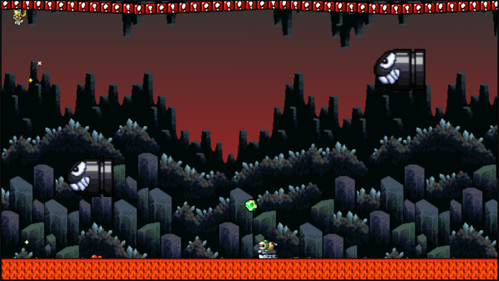
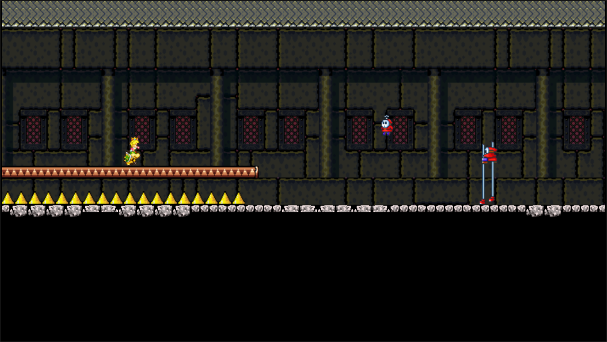

# Javascript Game
One-Button javascript game.

## [PLAY](https://crissky.github.io/baby-m-flyer/)

### [Between Pipes](https://crissky.github.io/baby-m-flyer/?game=1)

**Space key**, **left click**, **touch**: Fly Up (go up more if your face is all down).

### [Magnet Lava](https://crissky.github.io/baby-m-flyer/?game=2)

**Space key**, **left click**, **touch**: ON/OFF magnet (magnet on: rises until it sticks to the red blocks. magnet off: gravity works).

### [Castle Run](https://crissky.github.io/baby-m-flyer/?game=3)

**Space key**, **left click**, **touch**: Jump. (during the jump: quick fall).

